# FilersKeepers Web Crawling Project for Python Developer

## Problem Statement
You work for a content aggregation company that monitors product-related websites. Your current task is to crawl, monitor, and serve the data from a sample e-commerce website: https://books.toscrape.com. While this site is a simulation, treat it as production-grade.

Your responsibilities include:
1. Designing and implementing a scalable and fault-tolerant web crawling solution.
2. Implementing a change detection mechanism to maintain up-to-date records.
3. Creating RESTful APIs with authentication and filtering capabilities.
4. Ensuring the code is production-ready, with proper configuration, logging, and test coverage.

> Check the full project description [here](./assets/FK%20Crawling%20Project%20for%20Python%20Developers.pdf)

## Dependencies
- [Python >= 3.10](https://www.python.org/downloads/)
- [MongoDB Community Server == 8.2.2](https://www.mongodb.com/try/download/community)

## Setup
- Ensure that you have [Python](https://www.python.org/downloads/) and [MongoDB community server](https://www.mongodb.com/try/download/community) installed on your system. Follow the download instructions for your OS and confirm the installations by checking the `python` and `mongosh` versions in your terminal.
    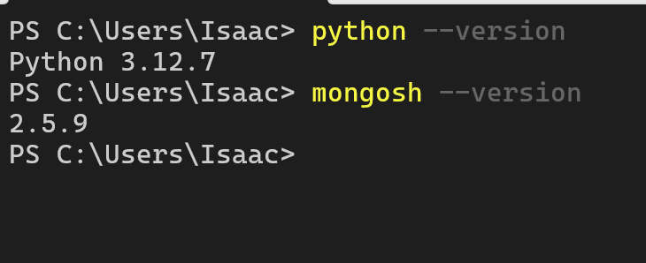
- Clone the repository:
    ```bash
    git clone git@github.com:toludaree/filerskeepers-project.git
    ```
- Move into the `filerskeepers-project` folder:
    ```bash
    cd filerskeepers-project/
    ```
- Create a Python virtual environment and activate it:
    ```bash
    # Windows
    python -m venv .venv
    .venv/Scripts/activate

    # Linux/MacOS
    python -m venv .venv
    source .venv/bin/activate
    ```
- Install all Python dependencies in [requirements.txt](./requirements.txt):
    ```bash
    pip install -r requirements.txt
    ```
- Create a .env file using the template given in [.env.example](./.env.example). The .env file include the mongodb collection names used by the crawler, scheduler, and api, the email configuration used for sending alert and error emails, and the JWT configuration used for API authentication.
    - You may change the default values in [.env.example](./.env.example) but they can also be left as-is.
    - `ADMIN_EMAIL` is the address that receives all alert and error emails. `EMAIL_SENDER` is the address used to send those emails.
    - You can use Python's [secrets](https://docs.python.org/3/library/secrets.html) module to generate a secure random value for `JWT_SECRET_KEY`.
    ```python
    import secrets
    secrets.token_urlsafe(32)
    ```

## Usage
> Ensure that you are in the `filerskeepers-project` directory before executing the instructions below. Do not navigate into any subfolders or parent folders.

### Tests
The crawler [process](./bookstoscrape/crawler/process.py) and [utils](./bookstoscrape/utils/crawler.py) logic is [tested](./bookstoscrape/tests/crawler.py) thoroughly. Confirm that all tests are still passing before moving forward:
```bash
python -m unittest bookstoscrape.tests.crawler
```

### Crawler
- The crawler is accessible via a simple CLI
    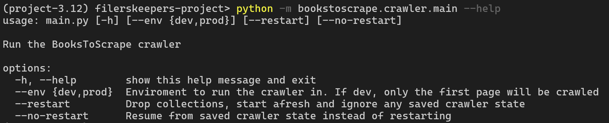
- Run the crawler with no parameters. This would use the default parameter values: `--env dev` and `--restart`.
    ```bash
    python -m bookstoscrape.crawler.main
    ```
- Check the `bookstoscrape/logs` folder for crawler logs. The log file names are formatted based on the time (UTC) the crawler was run.
- If an error occurs, an alert would be sent to your `ADMIN_EMAIL`.
    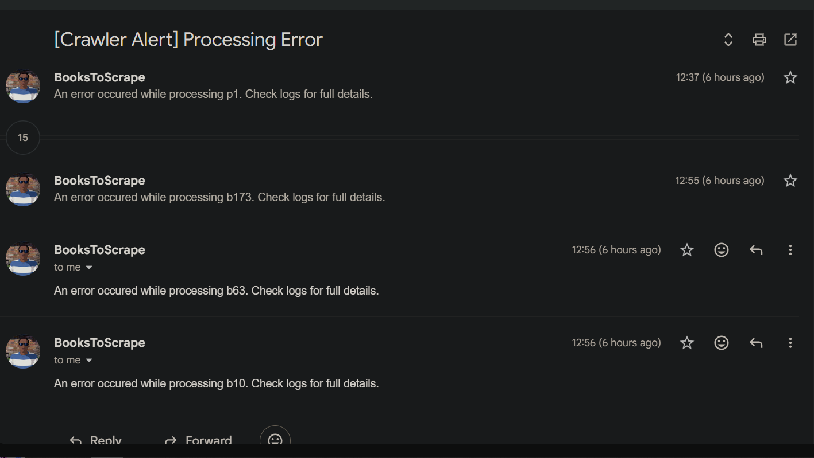
- Books are stored in the `MONGODB_BOOK_COLLECTION` collection.
    ```bash
    # Mongosh Shell
    #    - database name - bookstoscrape
    #    - book collection name -  books
    use bookstoscrape
    db.books.find()
    ```
    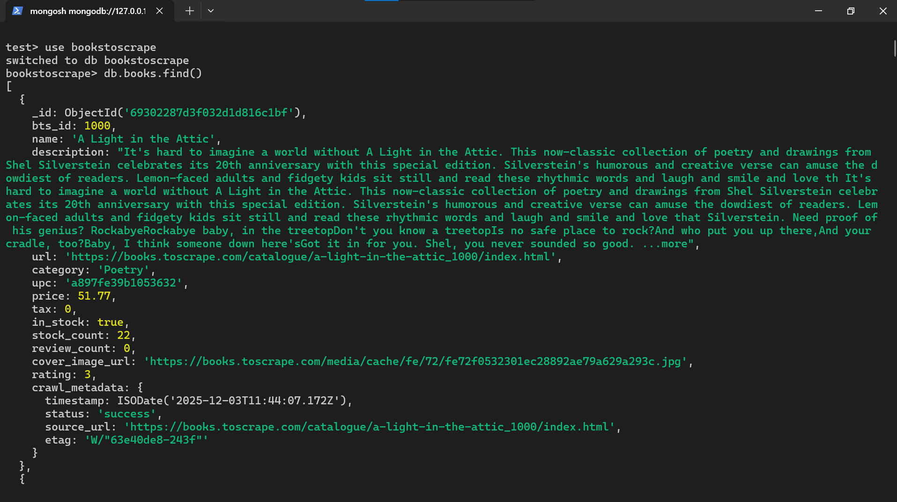
- HTML snapshots are stored in `bookstoscrape/snapshots/crawler`.
- If a crawler run completes with errors or ends prematurely due to too many errors, the crawler state is stored in the `MONGODB_CRAWLER_STATE_COLLECTION` collection.

#### Notes
- If an issue occurs, diagnose it using the logs and re-run the crawler with `--no-restart`. This would ensure that the crawler begins the new run from the last saved crawler state.
- Running the crawler with `--env dev` would only crawl the first page.
- Running the crawler with `--restart` renews the `MONGODB_BOOK_COLLECTION` collection with the results of the current run. The `MONGODB_CHANGELOG_COLLECTION` collection is dropped and will have no documents until the scheduler is run.
- You can change specific crawler settings in [settings.py](./bookstoscrape/settings.py). You can add proxy config, configure the number of workers, change the maximum number of retries and consecutive failures, and more.

### Scheduler
> The scheduler depends on the crawler to run its job. Therefore, the crawler [manager](./bookstoscrape/crawler/manager.py) has features for both the crawler and the scheduler.

- Start the scheduler. It will run everyday at 12:00 noon.
    ```bash
    python -m bookstoscrape.scheduler.main
    ```
- Scheduler logs are stored in `bookstoscrape/logs`.
- During a particular scheduler run, if a new book is found or any one is updated, an alert email would be sent to `ADMIN_EMAIL`.
    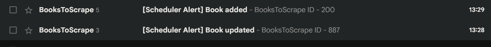
- If there are any errors, it would also be sent to `ADMIN_EMAIL`.
- Books found or updated are updated in the `MONGODB_BOOK_COLLECTION` collection accordingly and the specific changes are stored in the `MONGODB_CHANGELOG_COLLECTION` collection.
- At the end of a scheduler run, a daily report is stored in `bookstoscrape/reports`. [Here](./assets/sample_daily_report.json) is a sample daily report.
- HTML snapshots of the books found or updated are stored in `bookstoscrape/snapshots/scheduler`.

#### Notes
- The scheduler uses [APScheduler](https://apscheduler.readthedocs.io) and currently runs in a blocking mode. This is because APScheduler is typically embedded within an existing application, whereas it is being used here as a standalone service.
- MongoDB is used to store scheduled jobs, which means the scheduler can be started or stopped at any time. The default `MISFIRE_GRACE_TIME` is set to 5 hours, allowing a job to remain valid for that duration after its expected run time. You can adjust this value in [settings.py](./bookstoscrape/settings.py). The jobs are stored in the `MONGODB_SCHEDULED_JOBS_COLLECTION` collection.
- [BooksToScrape](https://books.toscrape.com/index.html) provides [HTTP Etags](https://developer.mozilla.org/en-US/docs/Web/HTTP/Reference/Headers/ETag) for each book page, and these are stored during the crawler run. During scheduler runs, the stored Etags are used to detect changes efficiently and avoid unnecessary processing when a page hasn’t changed.
- [BooksToScrape](https://books.toscrape.com/index.html) is mostly static therefore the scheduler would naturally find no changes. However, we can simulate changes by deleting and updating books in the book collection. Run this mongosh commands before the next scheduler run to simulate these changes:
    ```bash
    # Mongosh Shell
    #    - database name - bookstoscrape
    #    - book collection name -  books
    use bookstoscrape
    db.books.deleteMany({ bts_id: { $in: [50, 70, 200, 990, 14] } })
    db.books.update({ bts_id: 887 }, { $set: { "price": 24, "crawl_metadata.etag": "" } })
    db.books.update({ bts_id: 150 }, { $set: { "stock_count": 0, "in_stock": false, "crawl_metadata.etag": "" } })
    db.books.update({ bts_id: 550 }, { $set: { "rating": 4, "crawl_metadata.etag": "" } })
    ```

### API
- Start the API server:
    ```bash
    uvicorn bookstoscrape.api.main:app
    ```
- Open http://localhost:8000 in your browser to access FastAPI’s default Swagger UI.
- Create a new user using the `/signup` endpoint
- Login with your email and password via the Authorize button.
    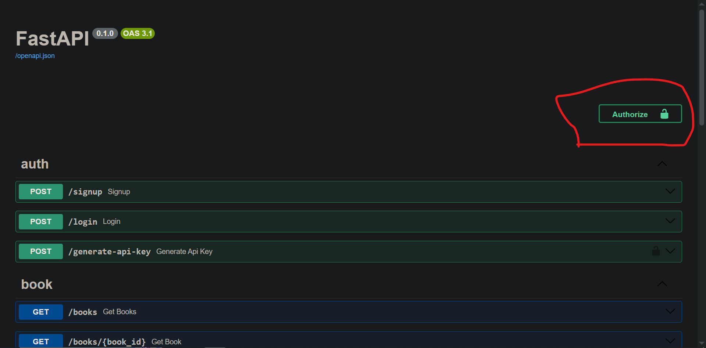
- Generate an API key via the `/generate-api-key` endpoint
- Access the main endpoints: `/books`, `/books/{book_id}`, and `/changes` using the API key generated.

#### Notes
- [slowapi](https://slowapi.readthedocs.io/en/latest/) is used to add rate limiting to all endpoints. You can change the rates in [settings.py](./bookstoscrape/settings.py).
- Users and API keys are stored in the `MONGODB_USERS_COLLECTION` and `MONGODB_API_KEYS_COLLECTION` respectively.

## Other

### Sample MongoDB document structure
- Books collection
    
- Changelog collection
    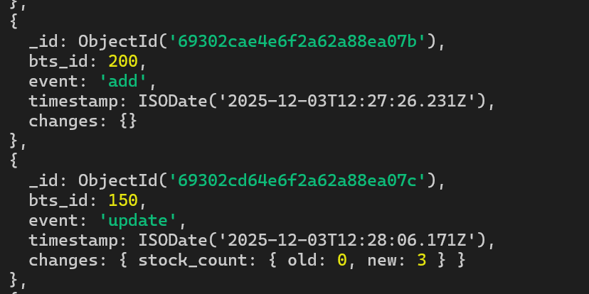
- Crawler state collection
    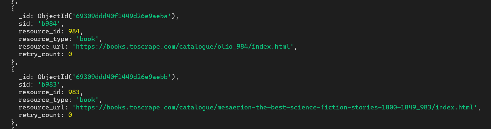
- Scheduled jobs collection
    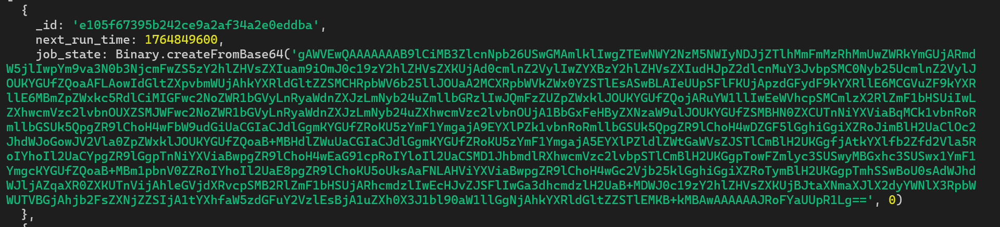
- Users collection
    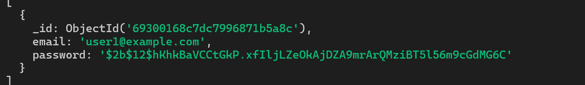
- API Keys collection
    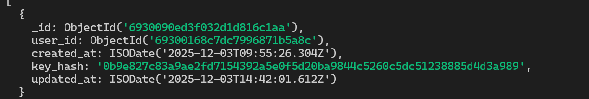

### Screenshot(s) or logs of successful crawl + scheduler runs
- [Successful crawler run](./assets/successful_crawler_run.log)
- [Successful scheduler run](./assets/successful_scheduler_run.log)
